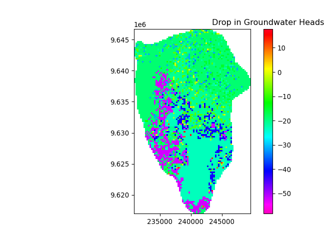

# Introduction

The present report summarizes the calculations and assumptions taken to
model recharge in Arusha, Tanzania, in under different landuse and
climate conditions. We briefly discuss the results with emphasis for
adaptation under climate change.

The available data includes:

-   one precipitation station with one year of precipitation values,
    year 2020
-   one evapotranspiration station with one year o reference
    evapotranspiration values, year 2020
-   land use map for the years 1995, 2020 and 2050.
-   soil map
-   simple transformation for precipitation (higher intensity, less
    frequency) and evapotranspiration (higher intensity) for the
    year 2050.
-   annual runoff per land use values used for calibration.

# Basic Assumptions

The recharge model is based on a simplified version of the Water Balance
Model and it is an implementation of the recharge excel workbook
model(Nonner & Stigter, 2015) The report is an adaptation to the one
submitted for completion of IHE lecture in Groundwater and Climate
Change. The novelty of this project is the adaptation of the class excel
worksheet to PCRaster (Karssenberg et al. 2010) framework.

The framework allows the implementation of distributed model with speed.
In comparison to the class assignment, where each class must be computed
in a new worksheet, here everything is done seemslesly in one script.

The integration in the python environment and open source community also
allow us to use the full output for spatial analysis and further
modelling, such as integration with groundwater modelling.

The model is built on top of the Dynamic Model framework from PCRaster
(Karssenberg et al. 2010) and it is available in the script:
`dynamic_model.py`.

The parameters used as input are detailed below.

## Parameters

We have estimated parameters for the water balance model comparing the
available land-use and soil classifications with data from the
literature.

Additionally, we have calibrated the runoff threshold parameter with the
runoff per land-use data supplied in the assignment.

### Available water

The total available water parameter was estimated based on the paper
(Romano and Santini 2002), where a graph of field capacity and permanent
wilting point for various soils are present.

The available water is estimated by the expression:

*A**W* = *F**C* − *W**P*

where *A**W* is the available water, *F**C* is the field capacity and
*W**P* is the wilting point. All units are fractions of the soil volume.

The estimated results are the following:

    ## Rows: 2 Columns: 2

    ## -- Column specification ---------------------------------------
    ## Delimiter: " "
    ## dbl (2): X1, X2

    ## 
    ## i Use `spec()` to retrieve the full column specification for this data.
    ## i Specify the column types or set `show_col_types = FALSE` to quiet this message.

| Soil Type  | soil code | Available Water |
|:-----------|----------:|----------------:|
| Sandy Clay |        10 |            0.13 |
| Silty Sand |        11 |            0.12 |

Available water table

#### Initial TAW

For the start of the simulation, the initial water content in every cell
was 50% of the TAW for that cell.

### Soil Root Depth

In our simplified unsaturated soil water balance model, the soil is
modeled only down to the maximum root depth of each vegetation. Water
that is driven below that depth is computed as groundwater recharge.

The depths were assigned to each landuse based on values tabulated in
the Wetspass-M model (Abdollahi et al. 2017). Table @ref:(tab:tab-root)
contains the estimations.

    ## Rows: 7 Columns: 2

    ## -- Column specification ---------------------------------------
    ## Delimiter: " "
    ## dbl (2): X1, X2

    ## 
    ## i Use `spec()` to retrieve the full column specification for this data.
    ## i Specify the column types or set `show_col_types = FALSE` to quiet this message.

| Land Use Type      | land use code | Root Depth (mm) |
|:-------------------|--------------:|----------------:|
| Urban              |             1 |             300 |
| Agriculture        |            21 |            1000 |
| Deciduous forest   |            31 |            1000 |
| Coniferous tree    |            32 |            1000 |
| Mixed forest       |            33 |            1000 |
| Shrub/Grassland    |            36 |             600 |
| Sparsely vegetated |           307 |             100 |

Root depth for every Land Use

### Crop factor

Crop factor is the parameter for calculating the potential
evapotranspiration of each land-use, based on the supplied reference
evapotranspiration. According to (Allen et al. 1998), the expression for
the calculation is:

*P**E**T* = *K**c* \* *R**E**T*
*P**E**T*: Potential Evapotranspiration

*K**c*: Crop factor *R**E**T*: Reference Evapotranspiration

Values were estimated based on the values tabulated in Wetspass-M
(Abdollahi et al. 2017) and values in the FAO guidelines for the
Penman-Monteith model (Allen et al. 1998). The results are in the Table
@ref(tab:crop-tab).

    ## Rows: 7 Columns: 2

    ## -- Column specification ---------------------------------------
    ## Delimiter: " "
    ## dbl (2): X1, X2

    ## 
    ## i Use `spec()` to retrieve the full column specification for this data.
    ## i Specify the column types or set `show_col_types = FALSE` to quiet this message.

| Land Use Type      | land use code | Crop Coef. |
|:-------------------|--------------:|-----------:|
| Urban              |             1 |        0.6 |
| Agriculture        |            21 |        1.5 |
| Deciduous forest   |            31 |        1.3 |
| Coniferous tree    |            32 |        1.2 |
| Mixed forest       |            33 |        1.2 |
| Shrub/Grassland    |            36 |        1.0 |
| Sparsely vegetated |           307 |        0.9 |

Crop factor values adopted for each landuse type in the model

### Readily Available Water

According to (Allen et al. 1998), evapotranspiration under water-stress
conditions can be modelled by the readily available water (RAW), which
is used to calculate the water stress coefficient (Figure @ref(fig:ks)).

In the PCRaster Recharge model, the water stress coefficient is modelled
indirectly, as the assigment’s excel sheet, using the RAW parameter.

The RAW parameter is estimated as 50 % of the TAW for all soil and
land-use types. This estimation is a common value for many crops (Allen
et al. 1998)

### Runoff threshold

In the model, runoff refers to the overland flow from precipitation.

The runoff is modelled by a threshold for precipitation intensity. The
model assigns precipitation that exceeds a given threshold as runoff.
Rainfall below the threshold infiltrates the soil zone.

Values for threshold were calibrated for each land use by running the
model in 2020 and verifying the model runoff to the given values. Here
we use PCRaster for analysis of the total runoff of each land use. The
table with calibrated and given values is displayed below.

    ## Rows: 7 Columns: 2

    ## -- Column specification ---------------------------------------
    ## Delimiter: " "
    ## dbl (2): X1, X2

    ## 
    ## i Use `spec()` to retrieve the full column specification for this data.
    ## i Specify the column types or set `show_col_types = FALSE` to quiet this message.

    ## New names:
    ## * `` -> ...1

    ## Rows: 7 Columns: 8

    ## -- Column specification ---------------------------------------
    ## Delimiter: ","
    ## chr (2): Land_Use, Unnamed: 0
    ## dbl (6): ...1, Runoff, No, Avg (mm/y), Min (mm/y), Max (mm/y)

    ## 
    ## i Use `spec()` to retrieve the full column specification for this data.
    ## i Specify the column types or set `show_col_types = FALSE` to quiet this message.

| Land Use Type      | land use code | Runoff Threshold (mm) | Runoff-measured | Avg runoff (mm) | Min runoff (mm) | Max runoff (mm) |
|:-------------------|--------------:|----------------------:|----------------:|----------------:|----------------:|----------------:|
| Urban              |             1 |                   5.0 |           419.1 |           429.3 |            35.6 |           670.5 |
| Agriculture        |            21 |                   7.0 |           295.3 |           325.3 |            30.8 |           704.2 |
| Deciduous forest   |            31 |                   8.5 |           224.1 |           229.5 |            30.9 |           674.5 |
| Coniferous tree    |            32 |                   9.0 |           203.3 |           218.6 |            33.4 |           549.7 |
| Mixed forest       |            33 |                   9.5 |           184.3 |           192.7 |            28.9 |           494.4 |
| Shrub/Grassland    |            36 |                   8.5 |           224.1 |           229.4 |            33.0 |           621.0 |
| Sparsely vegetated |           307 |                   8.5 |           224.1 |           235.2 |            10.2 |           646.6 |

Runoff Threshold parameters for each landuse type in the model

## Tasks

We will now procede by answering the assignment’s questions.

### Recharge estimation as function of land use change

    ## Rows: 4 Columns: 2

    ## -- Column specification ---------------------------------------
    ## Delimiter: ","
    ## dbl (2): Year, Recharge (mm)

    ## 
    ## i Use `spec()` to retrieve the full column specification for this data.
    ## i Specify the column types or set `show_col_types = FALSE` to quiet this message.

| Year | Recharge (mm) |
|-----:|--------------:|
| 1995 |         58.79 |
| 2020 |         58.83 |
| 2035 |         50.19 |
| 2050 |         48.90 |

Recharge as function of the predicted land use change

The results for the recharge indicate little variation due to change in
land use for the Arusha catchment. This is related to the fact that the
recharge calculated by urban areas is not very different from the
recharge of areas with poor vegetation and agriculture.

This behaviour of the model is due to the fact that the urbanization in
Arusha, from interpretation of the aerial photographs, does not cause
significant impermeabilization of the soil, except for the highly
urbanized downtown. Much of the city area is located under unpaved roads
and houses with clear terrain. Therefore, expansion of the city only
alters recharge slightly.

### Recharge Estimation Under Climate Change

    ## Rows: 2 Columns: 2

    ## -- Column specification ---------------------------------------
    ## Delimiter: ","
    ## dbl (2): Year, Recharge (mm)

    ## 
    ## i Use `spec()` to retrieve the full column specification for this data.
    ## i Specify the column types or set `show_col_types = FALSE` to quiet this message.

| Year | Recharge (mm) |
|-----:|--------------:|
| 1995 |         58.79 |
| 2050 |         21.35 |

Recharge as function of the predicted land use change and climate change

We see a large numerical difference between the values from Table
@ref(tab:rech-lan) and Table @ref(tab:rech-lan-clim). This is due to the
lower threshold in the Urban Area. Since the Urban area has limited
infiltration capacity, the heavy rainfall predicted under climate change
will mainly generate runoff, and it will impact groundwater recharge.

### Water abstractions compared with groundwater recharge

The assignment assigns a population growth model of 1.5 % per year for
the calculation of the abstraction demand. This can be represented by
the formula below:

*P*2020 \* (1+0.015)*n**y**e**a**r**s*

Where *P*2020 is the population in 2020 and
*n**y**e**a**r**s* is the number of years in 2020 and in
2050.

Therefore we have a population and water demands for 1995, 2020 and
2050:

    ## Rows: 3 Columns: 6

    ## -- Column specification ---------------------------------------
    ## Delimiter: ","
    ## dbl (6): Year, Population, Net Abstraction (Mm3), Abs per U...

    ## 
    ## i Use `spec()` to retrieve the full column specification for this data.
    ## i Specify the column types or set `show_col_types = FALSE` to quiet this message.

| Year | Population | Net Abstraction (Mm3) | Abs per Urban Cell (mm) | Recharge (mm) | Percentage of Recharge Abstracted (%) |
|-----:|-----------:|----------------------:|------------------------:|--------------:|--------------------------------------:|
| 1995 |   223302.7 |                  1.71 |                   94.83 |         58.79 |                                     0 |
| 2020 |   324000.0 |                  1.94 |                   26.09 |         58.83 |                                     0 |
| 2050 |   506438.0 |                  2.36 |                   18.62 |         21.35 |                                     0 |

Net Abstraction Calculations and Comparison to Recharge

Table @ref(tab:net-abs) summarises the calculated net abstractions and
derived quantities. The results suggests that abstraction is
sustainable, as the rates are very low compared to recharge.

Another interesting result from Table @ref(tab:net-abs) is that although
the Net abstraction is increasing, the expansion of the city is
increasing at a higher rate, and the overall results is a decrease in
abstraction per cell.

### Groundwater Drop due to change in Steady-state conditions

To estimate the groundwater drop due to urbanization and climate-change,
a few assumptions were made.

-   The current scenario, in 2020 is in steady-state. This is necessary
    for the simplified assumption in the next step.

-   The scenario in 2050 is the endmember scenario and the change in
    groundwater fluxes is linear with time. This means that we can
    compute the fluxes from initial scenario and from the last scenario
    and the average change in storage per year will be half of the
    difference between those fluxes. Multiplying by the number of years
    we get the change in storage:

$$ \\Delta S = \\frac{GW\_{2050}-GW\_{2020}}{2}\*t\_{years} $$

-   The groundwater fluxes inside the aquifer are ignored

-   The groundwater drop was calculated as the initial groundwater heads
    in 2020 plus the change in storage in m of aquifer.

*H**e**a**d**s**f**i**n**a**l* = *H**e**a**d**s**i**n**i**t**i**a**l* + *Δ**S*/*S**y*

    ## C:\Users\vcant\anaconda3\envs\qgispcraster\lib\site-packages\pcraster\matplotlib.py:154: MatplotlibDeprecationWarning: The 'cmap' parameter to Colorbar has no effect because it is overridden by the mappable; it is deprecated since 3.3 and will be removed two minor releases later.
    ##   cb = plt.colorbar(im, cmap=colour)

    ## The predicted average change in groundwater heads in the 30 year period (2020-2050) is of    -24 meters

The figure @ref(fig:drop-hed) shows the predicted head drop in meters
for the Arusha aquifer. The major drops are related to areas where new
cities are predicted, with values around 50 m. In the current city the
drop is predicted to around 25 m, while in the natural landscape, to -
10 m.

The maps shows the importance of managing the land for groundwater.
Unrestricted growth will severely impact groundwater heads, specially in
the urban area.

The average head drop predition is of 24 meters.

## Sustainability of Abstractions

As seen in the table @ref(tab:net-abs), abstractions are very low
compared to recharge. Therefore, I would conclude the abstractions are
sustainable.

On the other hand, the unplanned expansion of the Urban Area pose a
major threat to sustainability, as the recharge will be severely
impacted, specially under climate change scenarios.

Abdollahi, Khodayar, Imtiaz Bashir, Boud Verbeiren, Mahamane R. Harouna,
Ann Van Griensven, Marijke Huysmans, and Okke Batelaan. 2017. “A
Distributed Monthly Water Balance Model: Formulation and Application on
Black Volta Basin.” Journal Article. *Environmental Earth Sciences* 76
(5): 1–18.
https://doi.org/<http://dx.doi.org/10.1007/s12665-017-6512-1>.

Allen, Richard G, Luis S Pereira, Dirk Raes, and Martin Smith. 1998.
“Crop Evapotranspiration-Guidelines for Computing Crop Water
Requirements-FAO Irrigation and Drainage Paper 56.” Journal Article.
*Fao, Rome* 300 (9): D05109.

Karssenberg, Derek, Oliver Schmitz, Peter Salamon, Kor de Jong, and Marc
F. P. Bierkens. 2010. “A Software Framework for Construction of
Process-Based Stochastic Spatio-Temporal Models and Data Assimilation.”
Journal Article. *Environmental Modelling & Software* 25 (4): 489–502.
https://doi.org/<https://doi.org/10.1016/j.envsoft.2009.10.004>.

Romano, Nunzio, and Alessandro Santini. 2002. “Water Retention and
Storage: Field.” Book Section. In, 721–38.

